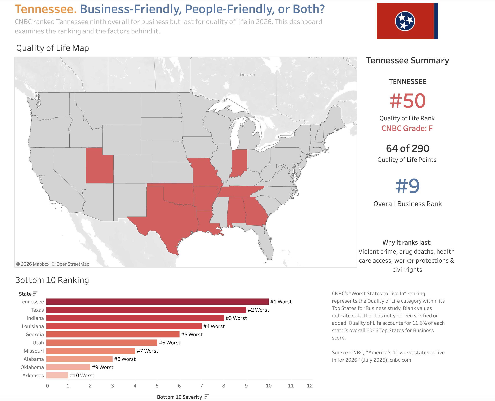

# Business-Friendly, People-Friendly, or Both?

An interactive Tableau dashboard comparing Tennessee's business-friendly standing with quality-of-life rankings across the United States.

[View the interactive Tableau dashboard](https://public.tableau.com/views/Tennessee_17839764631490/Business-FriendlyPeople-FriendlyorBoth)

## Project overview



States frequently promote strong business climates through taxes, infrastructure, workforce development, and economic growth. Those strengths do not always translate into equally strong outcomes for the people who live there.

This dashboard examines that tension by comparing business-friendly rankings with people-friendly or quality-of-life rankings. Tennessee serves as the primary case study, while the national map and state comparisons provide context.

## Questions explored

- How does Tennessee rank as a place to do business?
- How does Tennessee rank on measures connected to residents' quality of life?
- Which states perform well in both categories?
- Where are the largest gaps between business and people-focused rankings?

## Dashboard features

- Interactive map of the contiguous United States
- Tennessee-focused ranking comparison
- State-level tooltips
- Business-versus-people rank-gap analysis
- National comparisons and top-state context

## Key takeaway

Tennessee performs more strongly in business-oriented rankings than in people-oriented rankings. The dashboard highlights the difference between a state's economic reputation and the lived experience of its residents.

## Tools used

- Tableau Public
- Microsoft Excel / CSV
- Data cleaning and preparation
- Calculated fields and dashboard actions
- Geographic and comparative data visualization

## Data

The `data` folder contains the business-ranking CSV prepared for use in Tableau tooltips.

> **Data note:** Some entries in the current CSV are marked as pending verification because the source table could not be fully extracted automatically. These values should be checked against the original source before the dataset is treated as complete.

## Data sources

- CNBC, *America's Top States for Business 2026: Full Rankings*
- Quality-of-life ranking source used in the Tableau workbook

## Repository structure

```text
tennessee-business-people-dashboard/
├── README.md
├── LICENSE
├── .gitignore
├── data/
│   └── cnbc_2026_business_rankings_verified_partial.csv
└── images/
    └── dashboard-preview.png
```

## Author

David Bolt
